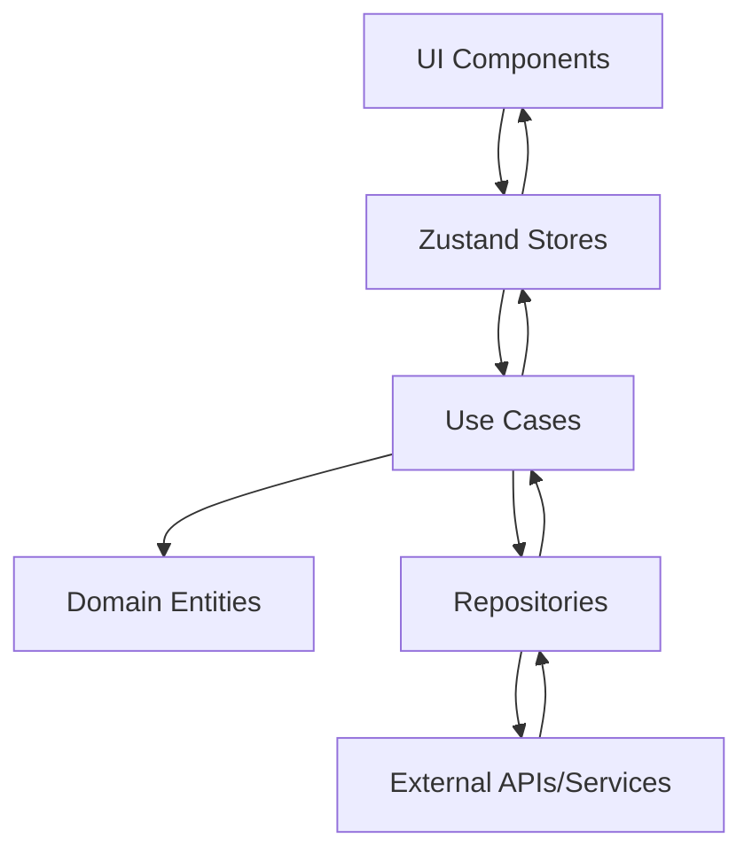

# 🏗️ Arquitectura del Sistema - Monitoreo Río Claro

## Visión General

El sistema utiliza **Clean Architecture** con inversión de dependencias, optimizado para React 19 y TypeScript. Implementa lazy loading, animaciones fluidas y exportación avanzada de reportes.

## Estructura Actualizada del Proyecto

```typescript
rioclaro-mokup/
├── src/
│   ├── domain/                 # 🎯 Capa de Dominio
│   │   ├── entities/          # Entidades de negocio
│   │   │   ├── User.ts        # Usuario del sistema
│   │   │   ├── Station.ts     # Estación de monitoreo
│   │   │   ├── Measurement.ts # Mediciones con filtros
│   │   │   ├── Alert.ts       # Sistema de alertas
│   │   │   ├── Report.ts      # Reportes generados
│   │   │   └── ActivityLog.ts # Logs de actividad
│   │   └── repositories/      # Contratos de repositorios
│   │
│   ├── application/           # 📋 Capa de Aplicación
│   │   └── use-cases/         # Casos de uso principales
│   │       ├── GenerateReports.ts
│   │       ├── GetMeasurements.ts
│   │       ├── GetStations.ts
│   │       └── ManageUsers.ts
│   │
│   ├── infrastructure/        # 🔧 Capa de Infraestructura
│   │   ├── adapters/          # Adaptadores y clientes
│   │   │   ├── ApiClient.ts
│   │   │   ├── ApiStationRepository.ts
│   │   │   └── Mock*Repository.ts (múltiples)
│   │   └── di/                # Inyección de dependencias
│   │       └── Container.ts
│   │
│   ├── presentation/          # 🎨 Capa de Presentación
│   │   ├── components/        # Componentes React organizados
│   │   │   ├── ui/            # Componentes base + utilidades
│   │   │   ├── layout/        # Navbar y estructura general
│   │   │   ├── charts/        # Dashboard y gráficos interactivos
│   │   │   └── maps/          # StationsMap con Leaflet
│   │   ├── pages/             # Páginas con lazy loading
│   │   │   ├── HomePage.tsx
│   │   │   ├── DashboardPage.tsx
│   │   │   ├── ReportsPage.tsx
│   │   │   ├── ActivityReportPage.tsx
│   │   │   └── AdminPage.tsx
│   │   ├── stores/            # Estado global Zustand
│   │   │   ├── StationStore.ts
│   │   │   ├── MeasurementStore.ts
│   │   │   ├── ReportStore.ts
│   │   │   └── UserStore.ts
│   │   └── hooks/             # Custom hooks de presentación
│   │
│   ├── shared/                # 🔄 Código Compartido
│   │   ├── components/        # MotionWrapper y reutilizables
│   │   ├── contexts/          # ThemeContext (dark/light mode)
│   │   ├── hooks/             # useBrowserDetect y hooks globales
│   │   ├── services/          # Servicios transversales
│   │   │   ├── DataNormalizationService.ts
│   │   │   ├── ExportService.ts (PDF/Excel)
│   │   │   └── ReportActivityService.ts
│   │   ├── types/             # Tipos TypeScript compartidos
│   │   │   ├── animation-types.ts
│   │   │   ├── chart-data.ts
│   │   │   ├── data-types.ts
│   │   │   └── motion-types.ts
│   │   └── utils/             # Funciones de utilidad
│   │
│   ├── examples/              # 📖 Ejemplos de uso
│   └── styles/                # 🎨 Estilos globales
│       └── cross-browser-animations.css
│
├── tests/                     # 🧪 Testing E2E con Playwright
├── docs/                      # 📚 Documentación completa
└── scripts/                   # 🔧 Scripts de utilidad
```

## 🎯 Capa de Dominio (`src/domain/`)

### Responsabilidades

- Contiene la **lógica de negocio pura** sin dependencias externas
- Define las **entidades** principales del sistema con tipado estricto
- Establece **contratos** para repositorios y servicios
- **No depende** de ninguna otra capa

### Entidades Principales

#### `Station.ts`

```typescript
export interface Station {
  id: number;
  name: string;
  location: string;
  code: string;
  status: 'active' | 'maintenance' | 'inactive';
  latitude: number;
  longitude: number;
  current_level: number;
  threshold: number;
  last_measurement: string;
  created_at: string;
  updated_at: string;
}
```

#### `Measurement.ts`

```typescript
export interface Measurement {
  id: number;
  station_id: number;
  station_name?: string;
  variable_type: string;
  value: number;
  unit: string;
  timestamp: string;
  is_critical: boolean;
  quality?: 'good' | 'fair' | 'poor';
}

export interface MeasurementFilters {
  stationId?: number;
  startDate?: string;
  endDate?: string;
  variableType?: string;
  isCritical?: boolean;
}
```

#### `Alert.ts`

```typescript
export interface Alert {
  id: number;
  station_id: number;
  type: 'water_level' | 'sensor_failure' | 'communication';
  severity: 'low' | 'medium' | 'high' | 'critical';
  message: string;
  is_active: boolean;
  created_at: string;
  resolved_at?: string;
}
```

#### `Report.ts`

```typescript
export interface Report {
  id: number;
  title: string;
  type: 'daily' | 'weekly' | 'monthly' | 'custom';
  station_ids: number[];
  date_range: {
    start: string;
    end: string;
  };
  generated_at: string;
  generated_by: number;
  file_path?: string;
}
```

#### `User.ts`

```typescript
export interface User {
  id: number;
  name: string;
  email: string;
  role: 'admin' | 'operator' | 'viewer';
  created_at: string;
  last_login?: string;
  is_active: boolean;
}
```

#### `ActivityLog.ts`

```typescript
export interface ActivityLog {
  id: number;
  user_id: number;
  action: string;
  resource_type: string;
  resource_id?: number;
  details: string;
  timestamp: string;
  ip_address?: string;
}
```

## 📋 Capa de Aplicación (`src/application/`)

### Responsabilidades

- Contiene los **casos de uso** del sistema
- Orquesta las **entidades de dominio**
- Define la **lógica de aplicación**
- **Independiente** de frameworks y UI

### Casos de Uso Principales

```typescript
// GenerateReports.ts - Generación de reportes
// GetMeasurements.ts - Obtención y filtrado de mediciones
// GetStations.ts - Gestión de estaciones
// ManageUsers.ts - Administración de usuarios
```

## 🔧 Capa de Infraestructura (`src/infrastructure/`)

### Responsabilidades

- Implementa los **repositorios** definidos en dominio
- Maneja **comunicación externa** (APIs, servicios)
- Proporciona **inyección de dependencias**
- **Depende** del dominio pero **no** de presentación

#### `ApiClient.ts`

Cliente HTTP centralizado para comunicación con backend:

```typescript
export class ApiClient {
  private baseURL: string;
  private timeout: number;

  async get<T>(endpoint: string): Promise<T>;
  async post<T>(endpoint: string, data: any): Promise<T>;
  async put<T>(endpoint: string, data: any): Promise<T>;
  async delete<T>(endpoint: string): Promise<T>;
}
```

#### `Container.ts`

Contenedor de inyección de dependencias:

```typescript
export class Container {
  private dependencies = new Map();

  register<T>(token: string, implementation: T): void;
  resolve<T>(token: string): T;
}
```

#### Repositorios Mock

Implementaciones de prueba para desarrollo:

- `MockStationRepository.ts`
- `MockMeasurementRepository.ts`
- `MockAlertRepository.ts`
- `MockReportRepository.ts`
- `MockUserRepository.ts`
- `MockActivityLogRepository.ts`

## 🎨 Capa de Presentación (`src/presentation/`)

### Responsabilidades

- **Interfaz de usuario** con React 19
- **Estado global** con Zustand
- **Enrutamiento** con React Router
- **Animaciones** con Framer Motion

### Páginas Principales

#### `HomePage.tsx`

Página de inicio con información del sistema y navegación animada.

#### `DashboardPage.tsx`

Dashboard principal con métricas en tiempo real:

- Gráficos interactivos con Recharts
- Indicadores de rendimiento (KPIs)
- Datos de estaciones en tiempo real
- Alertas activas

#### `ReportsPage.tsx`

Generación y exportación de reportes:

- Filtros avanzados por fecha y estación
- Exportación a PDF y Excel
- Visualización de datos históricos

#### `ActivityReportPage.tsx`

Logs de actividad del sistema:

- Historial de acciones de usuarios
- Filtros por tipo de actividad
- Exportación de logs

#### `AdminPage.tsx`

Panel de administración:

- Gestión de usuarios
- Configuración de estaciones
- Configuración de alertas

### Stores (Estado Global)

#### `StationStore.ts`

```typescript
interface StationState {
  stations: Station[];
  selectedStation: Station | null;
  loading: boolean;
  error: string | null;

  // Actions
  fetchStations: () => Promise<void>;
  selectStation: (station: Station) => void;
  createStation: (data: CreateStationData) => Promise<void>;
  updateStation: (id: number, data: UpdateStationData) => Promise<void>;
}
```

#### `MeasurementStore.ts`

```typescript
interface MeasurementState {
  measurements: Measurement[];
  filters: MeasurementFilters;
  loading: boolean;
  error: string | null;

  // Actions
  fetchMeasurements: () => Promise<void>;
  setFilters: (filters: Partial<MeasurementFilters>) => void;
  refreshData: () => Promise<void>;
}
```

### Componentes por Categoría

#### `components/ui/`

Componentes base del sistema de diseño:

- `Button`, `Input`, `Card` - Componentes básicos
- `ThemeToggle` - Cambio de tema claro/oscuro
- `PageLoading` - Indicador de carga
- `ExportButton` - Botón de exportación
- `WaterMascot` - Mascota animada del sistema

#### `components/layout/`

Componentes de estructura:

- `Navbar` - Navegación principal con tema adaptativo

#### `components/charts/`

Componentes de visualización:

- `MetricsDashboard` - Dashboard de métricas principales
- `NormalizedChart` - Gráficos con datos normalizados
- `MetricChart` - Gráficos individuales de métricas
- `MiniTrendChart` - Gráficos pequeños de tendencias

#### `components/maps/`

Componentes de mapas:

- `StationsMap` - Mapa interactivo con ubicaciones de estaciones

## 🔄 Capa Compartida (`src/shared/`)

### Servicios Transversales

#### `DataNormalizationService.ts`

Servicio para normalización automática de datos:

```typescript
export class DataNormalizationService {
  normalizeChartData(data: any[], sourceType: DataSourceType): ChartDataSet;
  transformMeasurements(measurements: Measurement[]): ChartDataPoint[];
}
```

#### `ExportService.ts`

Servicio de exportación a múltiples formatos:

```typescript
export class ExportService {
  exportToPDF(data: any[], options: ExportOptions): Promise<void>;
  exportToExcel(data: any[], options: ExportOptions): Promise<void>;
  exportToCSV(data: any[], options: ExportOptions): Promise<void>;
}
```

#### `ReportActivityService.ts`

Servicio de logs de actividad:

```typescript
export class ReportActivityService {
  logActivity(action: string, details: any): Promise<void>;
  getActivityHistory(filters: any): Promise<ActivityLog[]>;
}
```

### Contextos y Hooks

#### `ThemeContext.tsx`

Contexto para manejo de temas:

```typescript
interface ThemeContextType {
  theme: 'light' | 'dark';
  toggleTheme: () => void;
  setTheme: (theme: 'light' | 'dark') => void;
}
```

#### `useBrowserDetect.ts`

Hook para detección de navegador y capacidades.

### Tipos TypeScript

#### `animation-types.ts`

Tipos para animaciones con Framer Motion.

#### `chart-data.ts`

Tipos para datos de gráficos y visualizaciones.

#### `data-types.ts`

Tipos compartidos para datos del dominio.

#### `motion-types.ts`

Tipos para componentes con animaciones.

## 🔄 Flujo de Datos

### Arquitectura Unidireccional



### Flujo de Operaciones

1. **Componente UI** dispara una acción
2. **Store Zustand** maneja el estado
3. **Caso de Uso** ejecuta lógica de negocio
4. **Repositorio** accede a datos externos
5. **Entidades de Dominio** validan y procesan datos
6. **Resultado** se propaga de vuelta al UI

## 🎯 Principios Arquitectónicos

### Clean Architecture

- **Inversión de dependencias**: Las capas internas no dependen de las externas
- **Separación de responsabilidades**: Cada capa tiene un propósito específico
- **Testabilidad**: Fácil testing mediante inyección de dependencias
- **Escalabilidad**: Estructura modular que facilita el crecimiento

### Optimizaciones de Rendimiento

- **Lazy Loading**: Páginas cargadas bajo demanda
- **Code Splitting**: División automática de bundles
- **Memoización**: React.memo y useMemo estratégicos
- **Animaciones Optimizadas**: Framer Motion con GPU acceleration

### Patrones de Diseño

- **Repository Pattern**: Abstracción de acceso a datos
- **Dependency Injection**: Inversión de control
- **Observer Pattern**: Estado reactivo con Zustand
- **Facade Pattern**: Servicios que encapsulan complejidad
- **Strategy Pattern**: DataNormalizationService para diferentes fuentes

## 🧪 Testing y Calidad

### Playwright E2E Testing

```typescript
// tests/ - Testing end-to-end
├── animation-performance.spec.ts
├── cross-browser-performance.spec.ts
├── dashboard-performance.spec.ts
├── data-normalization.spec.ts
├── general-app.spec.ts
└── reports-chart.spec.ts
```

### Configuraciones de Calidad

- **ESLint**: Linting con reglas TypeScript y React
- **TypeScript Strict**: Tipado estricto en toda la aplicación
- **Path Mapping**: Imports absolutos para mejor organización

## 🚀 Deployment y Build

### Configuración Vite

```typescript
// vite.config.ts
export default defineConfig({
  plugins: [react()],
  resolve: {
    alias: {
      '@domain': path.resolve(__dirname, './src/domain'),
      '@application': path.resolve(__dirname, './src/application'),
      '@infrastructure': path.resolve(__dirname, './src/infrastructure'),
      '@presentation': path.resolve(__dirname, './src/presentation'),
      '@shared': path.resolve(__dirname, './src/shared'),
    }
  }
})
```

### Scripts de Build

```json
{
  "scripts": {
    "dev": "vite",
    "build": "tsc -b && vite build",
    "preview": "vite preview",
    "test": "playwright test",
    "test:ui": "playwright test --ui"
  }
}
```

Esta arquitectura garantiza mantenibilidad, escalabilidad y rendimiento óptimo para el sistema de monitoreo del Río Claro.
