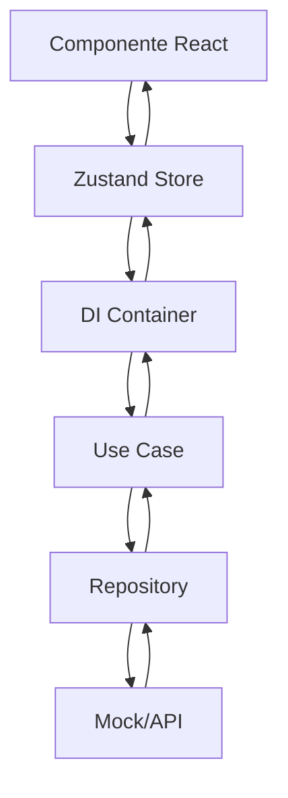

# 🏗️ Arquitectura del Sistema

## Estructura General del Proyecto

```
sistema-monitoreo-rio-claro-vite/
├── src/
│   ├── domain/                 # 🎯 Capa de Dominio
│   │   ├── entities/          # Entidades de negocio
│   │   └── repositories/      # Contratos de repositorios
│   │
│   ├── application/           # 📋 Capa de Aplicación
│   │   └── use-cases/         # Casos de uso por módulo
│   │       ├── station/
│   │       ├── measurement/
│   │       ├── alert/
│   │       ├── report/
│   │       └── user/
│   │
│   ├── infrastructure/        # 🔧 Capa de Infraestructura
│   │   ├── adapters/          # Adaptadores externos
│   │   │   ├── ApiClient.ts
│   │   │   └── Mock*Repository.ts
│   │   └── di/                # Inyección de dependencias
│   │       └── Container.ts
│   │
│   ├── presentation/          # 🎨 Capa de Presentación
│   │   ├── components/        # Componentes React
│   │   │   ├── ui/            # Componentes base
│   │   │   ├── layout/        # Layout components
│   │   │   └── charts/        # Componentes de gráficos
│   │   ├── pages/             # Páginas principales
│   │   └── stores/            # Estado global (Zustand)
│   │
│   ├── shared/                # 🔄 Utilidades Compartidas
│   │   ├── services/          # Servicios transversales
│   │   └── utils/             # Utilidades comunes
│   │
│   └── examples/              # 📖 Ejemplos y documentación
│
├── docs/                      # 📚 Documentación
├── public/                    # Archivos estáticos
└── dist/                      # Build de producción
```

## 🎯 Capa de Dominio (`src/domain/`)

### Responsabilidades
- Contiene la **lógica de negocio pura**
- Define las **entidades** principales del sistema
- Establece **contratos** (interfaces) para los repositorios
- **No depende** de ninguna otra capa

### Entidades Principales

#### `Station.ts`
```typescript
export interface Station {
  id: number;
  name: string;
  code: string;
  location: string;
  latitude: number;
  longitude: number;
  current_level: number;
  threshold: number;
  status: 'active' | 'inactive' | 'maintenance';
  last_measurement: string;
  created_at: string;
  updated_at: string;
}
```

#### `Measurement.ts`
```typescript
export interface Measurement {
  id: number;
  station_id: number;
  value: number;
  timestamp: string;
  created_at: string;
}

export interface MeasurementFilters {
  station_id?: number;
  start_date?: string;
  end_date?: string;
  limit?: number;
}
```

#### `Alert.ts`
```typescript
export interface Alert {
  id: number;
  station_id: number;
  type: 'critical' | 'warning' | 'info';
  message: string;
  level: number;
  threshold: number;
  status: 'active' | 'resolved' | 'acknowledged';
  created_at: string;
  resolved_at?: string;
}
```

#### `Report.ts`
```typescript
export interface DailyAverageData {
  date: string;
  station_id: number;
  station_name: string;
  average_level: number;
  max_level: number;
  min_level: number;
  measurement_count: number;
}

export interface CriticalEvent {
  id: number;
  station_id: number;
  station_name: string;
  water_level: number;
  threshold: number;
  timestamp: string;
  duration_minutes: number;
}

export type ExportFormat = 'csv' | 'pdf' | 'excel';
```

### Repositorios (Contratos)

```typescript
// Ejemplo: StationRepository.ts
export interface StationRepository {
  getAll(): Promise<Station[]>;
  getById(id: number): Promise<Station>;
  create(station: Omit<Station, 'id' | 'created_at' | 'updated_at'>): Promise<Station>;
  update(id: number, station: Partial<Station>): Promise<Station>;
  delete(id: number): Promise<void>;
}
```

## 📋 Capa de Aplicación (`src/application/`)

### Responsabilidades
- Contiene los **casos de uso** del sistema
- Orquesta las **interacciones** entre entidades
- Implementa la **lógica de aplicación**
- Depende solo de la **capa de dominio**

### Estructura de Use Cases

```
use-cases/
├── station/
│   ├── GetStationsUseCase.ts           # Obtener todas las estaciones
│   ├── GetStationByIdUseCase.ts        # Obtener estación por ID
│   ├── CreateStationUseCase.ts         # Crear nueva estación
│   ├── UpdateStationUseCase.ts         # Actualizar estación
│   └── DeleteStationUseCase.ts         # Eliminar estación
├── measurement/
│   ├── GetLatestMeasurementsUseCase.ts # Mediciones más recientes
│   ├── GetHistoricalMeasurementsUseCase.ts # Mediciones históricas
│   └── CreateMeasurementUseCase.ts     # Crear nueva medición
├── alert/
│   ├── GetActiveAlertsUseCase.ts       # Alertas activas
│   ├── CreateAlertUseCase.ts           # Crear alerta
│   └── ResolveAlertUseCase.ts          # Resolver alerta
├── report/
│   ├── GenerateDailyAverageReportUseCase.ts # Reporte de promedios
│   ├── GenerateCriticalEventsReportUseCase.ts # Reporte de eventos críticos
│   └── ExportReportUseCase.ts          # Exportar reportes
└── user/
    ├── LoginUseCase.ts                 # Autenticación
    ├── GetUserProfileUseCase.ts        # Perfil de usuario
    └── UpdateUserProfileUseCase.ts     # Actualizar perfil
```

### Ejemplo de Use Case

```typescript
// GetStationsUseCase.ts
export class GetStationsUseCase {
  constructor(private stationRepository: StationRepository) {}

  async execute(): Promise<Station[]> {
    try {
      const stations = await this.stationRepository.getAll();
      return stations.sort((a, b) => a.name.localeCompare(b.name));
    } catch (error) {
      throw new Error(`Error al obtener estaciones: ${error.message}`);
    }
  }
}
```

## 🔧 Capa de Infraestructura (`src/infrastructure/`)

### Responsabilidades
- Implementa los **repositorios** definidos en dominio
- Maneja **comunicación externa** (APIs, bases de datos)
- Proporciona **adaptadores** para servicios externos
- Gestiona **inyección de dependencias**

### Adaptadores

#### `ApiClient.ts`
```typescript
export class ApiClient {
  private baseURL: string;
  private token: string | null = null;

  constructor(baseURL: string) {
    this.baseURL = baseURL;
  }

  async get<T>(endpoint: string): Promise<ApiResponse<T>> {
    return this.request<T>(endpoint, { method: "GET" });
  }

  async post<T>(endpoint: string, body?: any): Promise<ApiResponse<T>> {
    return this.request<T>(endpoint, {
      method: "POST",
      body: body ? JSON.stringify(body) : undefined,
    });
  }

  // ... más métodos HTTP
}
```

#### Mock Repositories (Para desarrollo)

```typescript
// MockStationRepository.ts
export class MockStationRepository implements StationRepository {
  private stations: Station[] = [
    {
      id: 1,
      name: "Río Claro Norte",
      code: "RCN-001",
      location: "Sector Norte, km 15",
      latitude: -36.7485,
      longitude: -72.1219,
      current_level: 2.3,
      threshold: 3.0,
      status: "active",
      last_measurement: "2025-01-13T10:30:00Z",
      created_at: "2025-01-10T00:00:00Z",
      updated_at: "2025-01-13T10:30:00Z"
    },
    // ... más datos mock
  ];

  async getAll(): Promise<Station[]> {
    return Promise.resolve([...this.stations]);
  }

  async getById(id: number): Promise<Station> {
    const station = this.stations.find(s => s.id === id);
    if (!station) {
      throw new Error(`Estación con ID ${id} no encontrada`);
    }
    return Promise.resolve(station);
  }

  // ... más métodos
}
```

### Inyección de Dependencias

#### `Container.ts`
```typescript
export class DIContainer {
  private static instance: DIContainer;

  // Repositories
  private _stationRepository!: StationRepository;
  private _measurementRepository!: MeasurementRepository;
  private _alertRepository!: AlertRepository;
  private _reportRepository!: ReportRepository;

  // Use Cases
  public getStationsUseCase!: GetStationsUseCase;
  public getStationByIdUseCase!: GetStationByIdUseCase;
  public getLatestMeasurementsUseCase!: GetLatestMeasurementsUseCase;
  // ... más use cases

  static getInstance(): DIContainer {
    if (!DIContainer.instance) {
      DIContainer.instance = new DIContainer();
      DIContainer.instance.initialize();
    }
    return DIContainer.instance;
  }

  private initialize(): void {
    this.initializeRepositories();
    this.initializeUseCases();
  }

  private initializeRepositories(): void {
    // En desarrollo: usar mocks
    this._stationRepository = new MockStationRepository();
    this._measurementRepository = new MockMeasurementRepository();
    this._alertRepository = new MockAlertRepository();
    this._reportRepository = new MockReportRepository();

    // En producción: usar implementaciones reales
    // const apiClient = new ApiClient(API_BASE_URL);
    // this._stationRepository = new ApiStationRepository(apiClient);
    // this._measurementRepository = new ApiMeasurementRepository(apiClient);
    // ...
  }

  private initializeUseCases(): void {
    this.getStationsUseCase = new GetStationsUseCase(this._stationRepository);
    this.getStationByIdUseCase = new GetStationByIdUseCase(this._stationRepository);
    this.getLatestMeasurementsUseCase = new GetLatestMeasurementsUseCase(this._measurementRepository);
    // ... más use cases
  }
}
```

## 🎨 Capa de Presentación (`src/presentation/`)

### Responsabilidades
- Maneja la **interfaz de usuario**
- Gestiona el **estado de la aplicación**
- Presenta datos al usuario
- Captura **interacciones del usuario**

### Estructura de Componentes

```
components/
├── ui/                         # Componentes base reutilizables
│   ├── button.tsx
│   ├── card.tsx
│   ├── input.tsx
│   ├── select.tsx
│   └── dialog.tsx
├── layout/                     # Componentes de layout
│   ├── Navbar.tsx
│   ├── Footer.tsx
│   └── Layout.tsx
├── charts/                     # Componentes de gráficos
│   ├── NormalizedChart.tsx     # ⭐ Gráfico normalizado
│   ├── LineChart.tsx
│   └── BarChart.tsx
└── features/                   # Componentes específicos de funcionalidades
    ├── station/
    ├── measurement/
    ├── alert/
    └── report/
```

### Estado Global con Zustand

```typescript
// StationStore.ts
interface StationState {
  stations: Station[];
  loading: boolean;
  error: string | null;
  selectedStation: Station | null;
  
  // Actions
  fetchStations: () => Promise<void>;
  fetchStationById: (id: number) => Promise<void>;
  setSelectedStation: (station: Station | null) => void;
  clearError: () => void;
}

export const useStationStore = create<StationState>((set) => ({
  stations: [],
  loading: false,
  error: null,
  selectedStation: null,

  fetchStations: async () => {
    set({ loading: true, error: null });
    try {
      const container = DIContainer.getInstance();
      const stations = await container.getStationsUseCase.execute();
      set({ stations, loading: false });
    } catch (error) {
      set({ 
        error: error instanceof Error ? error.message : 'Error al cargar estaciones',
        loading: false 
      });
    }
  },

  // ... más acciones
}));
```

### Páginas Principales

```
pages/
├── HomePage.tsx                # Página de inicio
├── DashboardPage.tsx           # Dashboard principal con métricas
├── StationsPage.tsx            # Lista de estaciones
├── AlertsPage.tsx              # Gestión de alertas
├── ReportsPage.tsx             # Reportes y analytics
├── MapPage.tsx                 # Mapa de estaciones
└── AdminPage.tsx               # Administración
```

## 🔄 Capa Compartida (`src/shared/`)

### Responsabilidades
- Servicios **transversales** al sistema
- Utilidades **comunes** para todas las capas
- **Helpers** y funciones de apoyo

### DataNormalizationService ⭐

```typescript
export class DataNormalizationService {
  static normalize(rawData: any[], sourceType: DataSourceType): ChartDataSet {
    switch (sourceType) {
      case DataSourceType.MEASUREMENT:
        return this.normalizeMeasurements(rawData);
      
      case DataSourceType.STATION:
        return this.normalizeStations(rawData);
      
      case DataSourceType.API_V1:
        return this.normalizeApiV1(rawData);
      
      // ... más casos
      
      default:
        throw new Error(`Tipo de fuente no soportado: ${sourceType}`);
    }
  }

  private static normalizeMeasurements(data: any[]): ChartDataSet {
    const normalizedData = data.map(item => ({
      timestamp: item.timestamp || item.created_at,
      value: parseFloat(item.value || item.water_level || 0),
      label: item.station_name || 'Sin estación',
      station: item.station_id?.toString()
    }));

    return {
      data: normalizedData,
      metadata: {
        type: 'measurement',
        source: 'measurements',
        unit: 'm'
      }
    };
  }
}
```

### Utilidades

```typescript
// formatters.ts
export const formatDateTime = (dateString: string): string => {
  return new Date(dateString).toLocaleString('es-CL', {
    year: 'numeric',
    month: '2-digit',
    day: '2-digit',
    hour: '2-digit',
    minute: '2-digit'
  });
};

export const formatWaterLevel = (level: number): string => {
  return `${level.toFixed(2)}m`;
};
```

## 🚀 Flujo de Datos

### Flujo Típico de una Operación

1. **Usuario interactúa** con un componente React
2. **Componente** llama a una acción del store (Zustand)
3. **Store** obtiene el caso de uso del DI Container
4. **Caso de uso** ejecuta la lógica de negocio
5. **Caso de uso** llama al repositorio correspondiente
6. **Repositorio** (Mock/API) obtiene/modifica los datos
7. **Resultado** se propaga de vuelta al componente
8. **Componente** actualiza la UI



### Ejemplo Práctico: Cargar Estaciones

```typescript
// 1. Componente React
function StationsPage() {
  const { stations, loading, fetchStations } = useStationStore();

  useEffect(() => {
    fetchStations(); // 2. Llamada al store
  }, [fetchStations]);

  // ... render
}

// 2. Zustand Store
export const useStationStore = create<StationState>((set) => ({
  fetchStations: async () => {
    set({ loading: true });
    try {
      const container = DIContainer.getInstance(); // 3. DI Container
      const stations = await container.getStationsUseCase.execute(); // 4. Use Case
      set({ stations, loading: false });
    } catch (error) {
      set({ error: error.message, loading: false });
    }
  },
}));

// 4. Use Case
export class GetStationsUseCase {
  constructor(private stationRepository: StationRepository) {}

  async execute(): Promise<Station[]> {
    return await this.stationRepository.getAll(); // 5. Repository
  }
}

// 5. Repository (Mock)
export class MockStationRepository implements StationRepository {
  async getAll(): Promise<Station[]> {
    return Promise.resolve(this.mockStations); // 6. Datos mock
  }
}
```

## 🔄 Migración a Producción

### Cambiar de Mock a API Real

Para migrar a producción, solo necesitas cambiar la configuración del DI Container:

```typescript
// En Container.ts
private initializeRepositories(): void {
  if (process.env.NODE_ENV === 'production') {
    // Producción: usar APIs reales
    const apiClient = new ApiClient(API_BASE_URL);
    this._stationRepository = new ApiStationRepository(apiClient);
    this._measurementRepository = new ApiMeasurementRepository(apiClient);
  } else {
    // Desarrollo: usar mocks
    this._stationRepository = new MockStationRepository();
    this._measurementRepository = new MockMeasurementRepository();
  }
}
```

**Los componentes y use cases NO necesitan cambios** 🎉

## 🧪 Testing

### Arquitectura Testeable

```typescript
// Test de Use Case
describe('GetStationsUseCase', () => {
  it('should return sorted stations', async () => {
    // Arrange
    const mockRepo = new MockStationRepository();
    const useCase = new GetStationsUseCase(mockRepo);

    // Act
    const result = await useCase.execute();

    // Assert
    expect(result).toHaveLength(3);
    expect(result[0].name).toBe('Río Claro Centro');
  });
});

// Test de componente
describe('StationsPage', () => {
  it('should render stations list', () => {
    render(<StationsPage />);
    expect(screen.getByText('Estaciones de Monitoreo')).toBeInTheDocument();
  });
});
```

## 📈 Beneficios de esta Arquitectura

### ✅ Ventajas

1. **Mantenibilidad**: Código organizado y fácil de entender
2. **Testabilidad**: Cada capa se puede testear independientemente
3. **Escalabilidad**: Fácil agregar nuevas funcionalidades
4. **Flexibilidad**: Cambiar implementaciones sin afectar otras capas
5. **Reutilización**: Componentes y servicios reutilizables
6. **Separación de responsabilidades**: Cada capa tiene un propósito claro

### 🎯 Casos de Uso Específicos

- **Cambio de API**: Solo modificas los repositorios
- **Nueva funcionalidad**: Sigues el patrón establecido
- **Cambio de UI**: Solo afecta la capa de presentación
- **Testing**: Fácil mockear dependencias
- **Migración**: De desarrollo a producción sin cambios masivos

Esta arquitectura garantiza que el sistema sea **mantenible**, **escalable** y **testeable** a largo plazo.